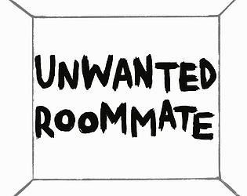

# Unwanted-Roommate-GTMK2021
  
  

  

  
  
Unwanted Roommate is a game made with Unity for the [2021 GMTK Game Jam](http://itch.io/jam/gmtk-2021) in the span of 48 hours.  
The theme for this years' Jam was "Joined Together". We chose to make a game were you have to deal with your unescapable anxiety : your Unwanted Roommate.
It is the first project where we got to work with original art assets. The game is bit janky since we are still learning how to use the Unity Game Engine, none the less we loved woking on this project and are thrilled to work together again !

This game was made by theses lovely folks :
* [@nispouli](https://instagram.com/nispouli/) (art)
* [@mdeloffre](https://github.com/mdeloffre) (music/code)
* [@rubengres](https://github.com/rubengres) (code)  

You can play the game [here](https://ohmlet.itch.io/unwanted-roommate-v2)
